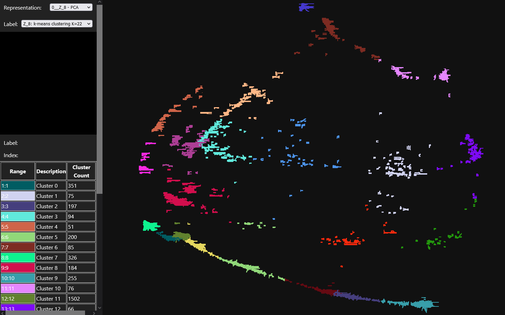

<p align="center">
  
  <h1 align="center"><strong>Clustering and Anomaly Detection in Embedding Spaces for the Validation of Automotive Sensors</strong></h3>

  <p align="center">
      <a href="https://www.linkedin.com/in/alexanderfertig/" >Alexander Fertig</a><sup>1</sup>,&nbsp;&nbsp;
      <a href="https://www.linkedin.com/in/lakshman-balasubramanian-50548477/" >Lakshman Balasubramanian</a><sup>1</sup>&nbsp; and &nbsp;
      <a href="https://www.thi.de/personen/prof-dr-ing-michael-botsch/" >Michael Botsch</a><sup>1</sup>&nbsp;&nbsp;
    <br>
    <small><sup>1</sup>Technische Hochschule Ingolstadt, Germany</small>
  </p>
</p>


> **Abstract:** In order to reliably validate autonomous driving functions, known risks must be taken into account and unknown risks must be identified. This work addresses this challenge by investigating risks at the level of object state estimations. The proposed methodology utilizes the differences between object state estimations from independent sensors, enabling the detection of relevant differences. This is a significant advantage, because sensor errors can be detected without ground truth. A deep autoencoder architecture is introduced to map the differences between state estimations into a latent space. The autoencoder contains Transformer and LSTM components to effectively process signals of varying lengths. The latent space is shaped using a k-means friendly design procedure, in order to find a suitable representation for anomaly detection. Detecting anomalies is a key component in the validation process of autonomous vehicles, contributing to the identification of unknown risks. The proposed approach is evaluated using real-world automotive sensor data from cameras and laser scanners in the publicly available nuScenes dataset. The results show that the generated latent space using the k-means friendly procedure is well suited for clustering differences between state estimations from these two sensors and thus for anomaly detection. In the framework specified in the safety standard ISO 21448 (SOTIF) the proposed methodology can play a key role for the detection of unknown risks on the perception level during the operation phase of autonomous vehicles.


## Installation

1. Clone this repository
2. Download the data from [Data-Link](https://faubox.rrze.uni-erlangen.de/getlink/fiSsrNqZMH2dg7W8q7MaEF/nuscenes) and unzip it into the `\data`, rooted in the project directory (the resulting path for e.g., the training data is `\data\nuscenes\train\base\`). This data contains the processed and associated object pairs from the nuScenes train and evaluation split, hereby one sample corresponds to one object pair and not a whole scene as in the original nuScenes dataset.
3. Run `python main.py` to train the model, adjust parameters as required in `main.py`.


## Visualization

Visualize the created latent embedding space by the interactive visualization tool [DIFFINSPECT](https://MB-Team-THI.github.io/DIFFINSPECT/), based on [UMAP-Explorer](https://github.com/GrantCuster/umap-explorer/).

  


## Acknowledgments
The authors acknowledge the support of ZF Friedrichshafen AG.

We would especially like to thank the authors for their open source contributions that made this project possible.

- [StreamPETR](https://github.com/exiawsh/StreamPETR)
- [FocalFormer3D](https://github.com/NVlabs/FocalFormer3D)
- [UMAP-Explorer](https://github.com/GrantCuster/umap-explorer/)
  


## Citation
```
@InProceedings{Fertig2024,
  author     = {Alexander Fertig and Lakshman Balasubramanian and Michael Botsch},
  booktitle  = {2024 IEEE Intelligent Vehicles Symposium (IV)},
  title      = {Clustering and Anomaly Detection in Embedding Spaces for the Validation of Automotive Sensors},
  year       = {2024},
  pages      = {1083-1090},
}
```
